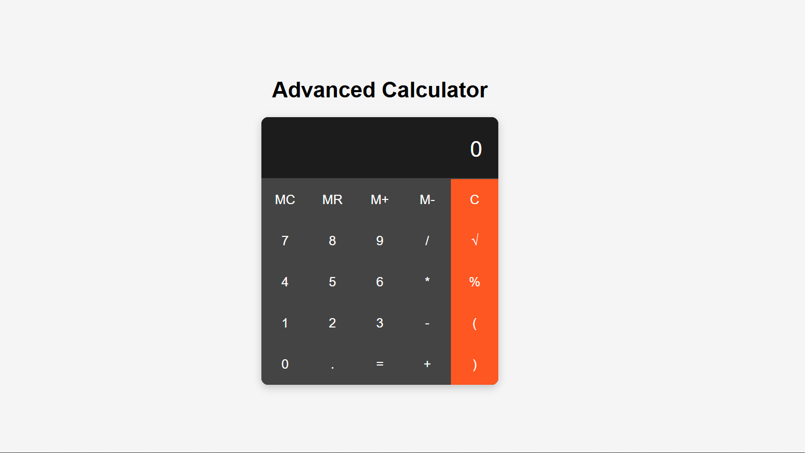

Advanced Calculator

<!-- Replace with a screenshot of your calculator -->

Welcome to the Advanced Calculator! This powerful and intuitive calculator is built with React and designed to provide a seamless user experience for all your mathematical needs.

📦 Features
Basic Operations: Addition, subtraction, multiplication, and division.
Advanced Functions: Square roots, powers, logarithms, and more!
User-Friendly Interface: A clean, modern design that makes calculations a breeze.
History Log: Keep track of your calculations and results.
Responsive Design: Works beautifully on desktop and mobile devices.
🚀 Getting Started
Prerequisites
Make sure you have the following installed on your machine:

Node.js
npm or yarn
Installation
Clone the repository:

bash
Copy code
git clone https://github.com/deepakpatil26/react_calculator.git
Navigate to the project directory:

bash
Copy code
cd react_calculator
Install the dependencies:

bash
Copy code
npm install

# or

yarn install
Start the development server:

bash
Copy code
npm start

# or

yarn start
Your calculator will be running on http://localhost:3000.

🎨 Technologies Used
React: A JavaScript library for building user interfaces.
CSS: For styling the application.
JavaScript: For implementing the calculator's logic.

🤝 Contributing
Contributions are welcome! If you have suggestions or improvements, please fork the repository and submit a pull request.

Fork the project
Create your feature branch (git checkout -b feature/AmazingFeature)
Commit your changes (git commit -m 'Add some amazing feature')
Push to the branch (git push origin feature/AmazingFeature)
Open a pull request

✨ Acknowledgments
Inspired by the need for a powerful calculator tool.
Thanks to the open-source community for invaluable resources and support.
